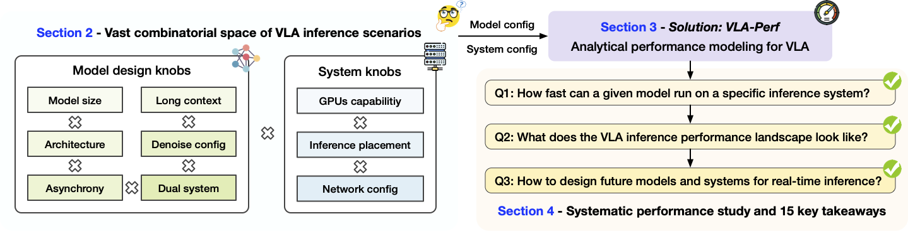
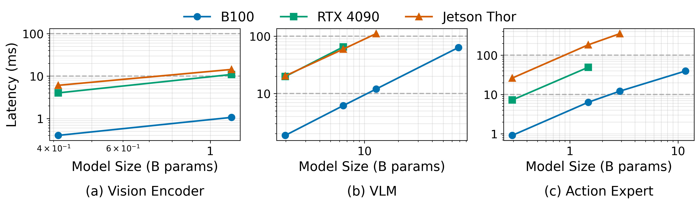
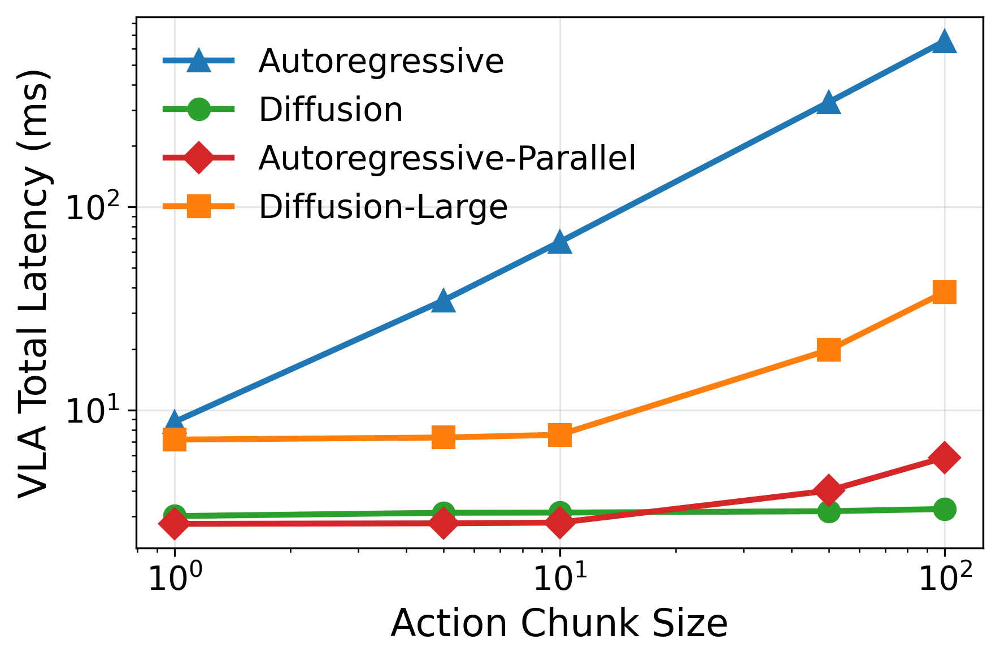
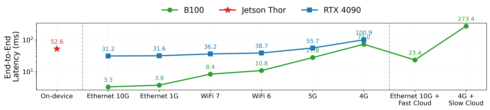
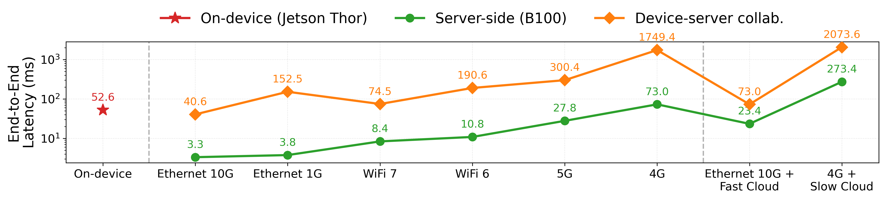

# VLA-Perf: Performance Modeling for Vision-Language-Action Models in Robotics

This repository provides analytical performance modeling tools for **Vision-Language-Action (VLA)** models — the emerging class of foundation models that combine vision encoders, language model backbones, and action prediction heads to control robots directly from images and language instructions. 

📄 Paper: [How Fast Can I Run My VLA? Demystifying VLA Inference Performance with VLA-Perf](https://arxiv.org/pdf/2602.18397)

<p align="center">
  
</p>

VLA-Perf models the **inference latency** of VLA architectures across:
- **Hardware platforms**: Data center GPUs (A100, H100, B100), edge GPUs (RTX 4090), and embedded devices (NVIDIA Jetson family)
- **Network conditions**: WiFi 5/6/6E/7, 4G/5G cellular, Ethernet (1G–400G), and cloud links
- **Deployment scenarios**: On-device, edge-server, cloud, and device-server collaboration (split inference)
- **Architecture design choices**: Model scaling, diffusion vs autoregressive action heads, denoising steps, action chunk sizes, and observation context length

## Repository Structure

```
.
├── README.md               # This file
├── LICENSE                 # Apache 2.0 License
├── vla-perf/               # VLA performance modeling (main contribution)
│   ├── pi0_perf.py         # Core script: Pi0 experiments used in the paper
│   ├── perf_utils.py       # Shared utilities for performance evaluation
│   ├── openvla_perf.py     # OpenVLA performance evaluation
│   ├── network_latency.py  # Network latency estimation
│   ├── perf_results/       # Output CSV results
│   ├── paper_figures/      # Generated plots (PDF + PNG)
│   ├── paper_tables/       # Generated LaTeX tables
│   ├── plot_scripts/       # Scripts for figure and table generation
│   └── test_scripts/       # Test and debugging utilities
└── genz/                   # GenZ LLM Analyzer (hardware performance backend)
```

## Quick Start

### 1. Set up the environment

```bash
conda create -n vla-perf python=3.10
conda activate vla-perf
```

### 2. Install GenZ (hardware modeling backend)

```bash
cd genz
pip install -e .
```

### 3. Run the Pi0 performance evaluation

```bash
cd ../vla-perf
python pi0_perf.py
```

This runs all 7 experiments from the paper and saves results to `vla-perf/perf_results/`. See the [vla-perf README](vla-perf/README.md) for details on each experiment and how to selectively enable/disable them.

### 4. Generate paper figures and tables

```bash
cd vla-perf/plot_scripts
python print_1_base_pi0.py          # Base performance tables
python print_2_scale_model.py       # Model scaling plots
python print_3_long_context.py      # Long context plot
# ... etc. (see plot_scripts/ for the full list)
```

Output figures are saved to `vla-perf/paper_figures/` and tables to `vla-perf/paper_tables/`.

## VLA Models Studied

### Pi0 (Physical Intelligence)

The primary model studied in this work. Pi0 uses a three-stage pipeline:

1. **Vision encoder** (SigLIP SoViT-400m) — encodes multi-view camera images into visual tokens
2. **VLM backbone** (Gemma 2B) — processes visual tokens and language instructions
3. **Action Expert** (Diffusion Transformer, ~300M) — generates actions via Flow Matching with N denoising iterations

### OpenVLA

An open-source VLA baseline using a dual vision encoder (DINOv2 + SigLIP) with a Llama 2 7B backbone that generates discretized actions autoregressively.

## Experiments

The main script `vla-perf/pi0_perf.py` contains 7 experiments:

| # | Experiment | Key Question |
|---|---|---|
| 1 | Base E2E Performance | How fast is Pi0 on different hardware? |
| 2 | Model Size Scaling | How does latency grow with larger vision/VLM/action models? |
| 3 | Long Context | What is the cost of longer observation history? |
| 4 | Denoising Steps x Action Lengths | How do diffusion steps and action chunk size trade off? |
| 5 | Autoregressive vs Diffusion | Which action generation strategy is faster? |
| 6 | Device vs Server | When is on-device inference competitive with server inference? |
| 7 | Device-Server Collaboration | Can split inference (vision on-device, VLM on server) help? |

### Sample Results

**Model Size Scaling** — Latency vs model size for each Pi0 component across B100, RTX 4090, and Jetson Thor:

<p align="center">
  
</p>

**Autoregressive vs Diffusion** — Diffusion-based action generation scales much better than autoregressive with increasing action chunk size:

<p align="center">
  
</p>

**Device vs Server** — E2E latency comparison across on-device, edge-server, and cloud deployment under different network conditions:

<p align="center">
  
</p>

**Device-Server Collaboration** — Split inference (Helix-style) vs server-only and on-device baselines:

<p align="center">
  
</p>

## GenZ: Hardware Performance Modeling Backend

This project builds on top of [GenZ LLM Analyzer](https://github.com/abhibambhaniya/GenZ-LLM-Analyzer), an analytical performance modeling tool for transformer inference. GenZ estimates latency and memory usage given a model architecture, hardware platform, precision, and parallelism configuration.

We extend GenZ with several additions for VLA workloads:

- **Parallel decode modeling** (new) — models diffusion-based action generation where multiple tokens are decoded in parallel per denoising step, with cross-attention to the VLM's KV cache. This is critical for modeling Flow Matching in Pi0's Action Expert.
- **VLA model configs** (new) — added model definitions for Pi0 (vision, VLM, action expert), Pi0.6, OpenVLA, and SigLIP/DINOv2 vision encoders (`genz/GenZ/Models/Model_sets/vla_models.py`).
- **Hardware configs** (extended) — added specs for NVIDIA B100, RTX 4090, and the full Jetson family (AGX Thor, AGX Orin, Orin NX, Orin Nano, AGX Xavier, Xavier NX) alongside existing A100 and H100 configs (`genz/Systems/system_configs.py`).
- **Prefill modeling** — used for vision encoders and VLM backbone (processes all input tokens at once).
- **Decode modeling** — used for autoregressive action token generation (one token at a time, as in OpenVLA).
- **Parallelism** — tensor parallel and pipeline parallel strategies across multi-GPU setups.

For more details on the base GenZ framework, see the [GenZ README](genz/README.md).

## Citation

If you find this repository or the paper helpful, we would appreciate it if you could cite our work:

```
@article{jiang2026fast,
  title={How Fast Can I Run My VLA? Demystifying VLA Inference Performance with VLA-Perf},
  author={Jiang, Wenqi and Clemons, Jason and Sankaralingam, Karu and Kozyrakis, Christos},
  journal={arXiv preprint arXiv:2602.18397},
  year={2026}
}
```

## License

This project is released under the [Apache 2.0 License](LICENSE).
